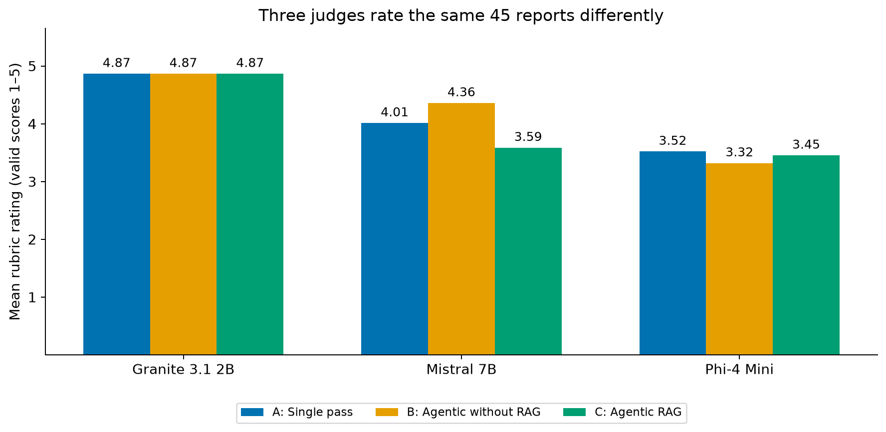
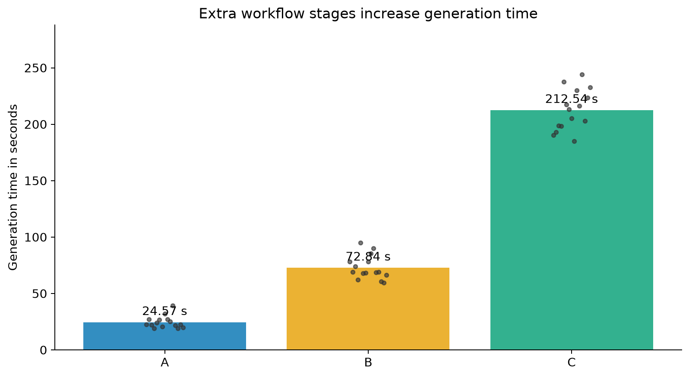
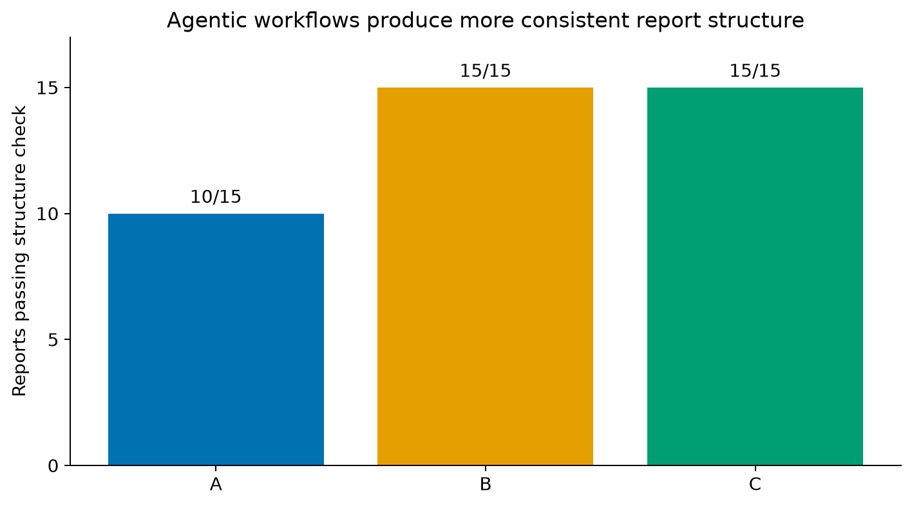
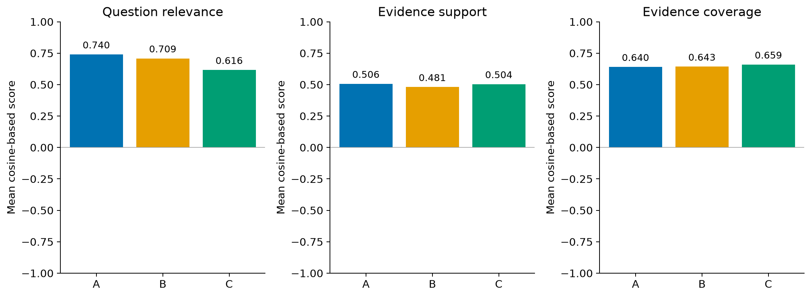

# Design and Evaluation of an Agentic AI System for Automated Research and Report Generation using Retrieval-Augmented Generation (RAG)

**Student:** Adarsh Konderu  
**Project type:** MSc dissertation research prototype  
**Implementation:** Python notebooks developed for Google Colab  
**Current status:** Core workflow and frozen evaluation completed; human evaluation is future work

## Project overview

Large language models can produce well-written reports, but they can also include
unsupported statements, incorrect facts or references that do not support the
claim. This is especially important in healthcare-related research, where a fluent
answer should not automatically be treated as a reliable answer.

In this project, I designed and evaluated an Agentic Retrieval-Augmented Generation
(RAG) prototype for producing research reports about AI in healthcare. Instead of
asking one model to write an answer immediately, the system divides the work into
separate roles. It plans the report, retrieves evidence, reviews the evidence,
writes cited sections, checks the report and records an audit trace.

The aim is not to create a clinical decision-making system. It is a research
prototype for investigating evidence grounding, citation transparency and the
limitations of automated report generation.

## Research question

**How can an Agentic AI system integrated with Retrieval-Augmented Generation
improve the factual support, relevance, coherence, completeness and citation
quality of automatically generated research reports about AI in healthcare?**

## Objectives

My main objectives were to:

1. build a focused research corpus from eligible PubMed Central material;
2. compare semantic retrieval with a hybrid dense and BM25 method;
3. design an understandable multi-role report-generation workflow;
4. require visible PMC citations and preserve the evidence used for each report;
5. add structural checking and sentence-level automated claim verification;
6. compare three controlled generation conditions using the same base generator;
7. evaluate the frozen reports using descriptive measures and blinded model judges;
8. record limitations honestly and preserve enough information for reproduction.

## System workflow

```text
Research question
        |
        v
Planner creates four report sections and focused search queries
        |
        v
Hybrid retriever combines dense similarity and BM25 rankings
        |
        v
Evidence reviewer selects relevant and diverse PMC passages
        |
        v
Writer produces sections using the approved passages and PMC citations
        |
        v
Report reviewer performs structural and citation checks
        |
        v
NLI claim verifier compares claims with the cited evidence
        |
        v
One conditional revision may be attempted when checks identify a problem
        |
        v
Report + sources + checks + prompts + execution trace are saved
```

The roles are implemented as Python functions with different instructions. During
this development stage, the planner, evidence reviewer, writer and report reviewer
use the same pinned Qwen generator; they are not four independently trained models.
A separate Natural Language Inference model is used for automated claim checking.
The orchestration is written directly in Python and does not use LangChain.

## Evidence corpus and retrieval

The frozen working corpus contains 46 PMC articles divided into 1,415 cleaned
passages. It covers five healthcare-AI themes:

- medical imaging and diagnosis;
- clinical decision support;
- healthcare operations;
- generative AI and large language models;
- ethics, safety and bias.

Dense retrieval uses `sentence-transformers/all-MiniLM-L6-v2` to compare semantic
meaning. BM25 rewards important matching words. Weighted Reciprocal Rank Fusion
combines the two rankings, and a source-diversity rule prevents one article from
dominating the final selection. A retrieval score is a ranking value; it is not a
mark out of five and it is not the probability that a passage is true.

## Controlled experiment

I froze 15 research questions before the formal generation stage. Every question
was processed under three conditions, creating 45 reports in total:

| Condition | Description |
|---|---|
| **A — Direct** | One direct response from the Qwen model, without agent roles or retrieval |
| **B — Agentic, no RAG** | Planner, writer and reviewer roles using model knowledge without retrieved passages |
| **C — Agentic RAG** | Hybrid retrieval, evidence review, passage-bound writing, citations and claim verification |

The same generator, deterministic decoding approach and fixed question set were
used to make the comparison more controlled. Condition C still changes several
components together, so the experiment cannot prove which individual component
caused a difference. A future ablation study would be needed for that question.

## Evaluation approach

The project keeps generation separate from evaluation. After all reports were
frozen, I calculated descriptive measures such as report length, section structure,
generation time, citation count, question relevance and evidence-support measures.

I also used three independent model judges—Granite, Mistral and Phi—to assess the
same frozen reports in a blinded order. Their rubric considered:

- factual support;
- relevance to the research question;
- coherence;
- completeness;
- responsible framing.

These are automated judgements rather than human evaluation. Models can disagree,
misread evidence or produce invalid structured output. I therefore treat their
scores as additional experimental evidence, not as proof of correctness. A
carefully designed human evaluation would strengthen the project in future work.

## Key results

- Agentic Conditions B and C passed the required structure check for all 15
  reports, compared with 10 of 15 for Condition A.
- Condition C provided 92 visible citations and the highest mean evidence coverage
  (0.659), but it was approximately 8.7 times slower than Condition A.
- The pooled judge score was 4.133 for A, 4.182 for B and 3.969 for C. The
  difference was not statistically significant (Friedman p = .109).
- Agreement between the three judges was low (ICC(2,1) = .058), so one automated
  judge would not be a reliable substitute for human evaluation.

The graphs below are derived from the frozen evaluation records. Full-size images
and aggregate CSV tables are available in [`results/`](results/).









## Repository structure

```text
.
├── README.md
├── FILE_SHA256.json
├── docs/
│   ├── DATA_AND_REPRODUCIBILITY.md
│   └── LIMITATIONS.md
├── results/
│   ├── README.md
│   ├── figures/ — four evaluation graphs
│   └── tables/ — aggregate descriptive and statistical results
└── notebooks/
    ├── 00_START_HERE_Live_Project_Demo.ipynb
    └── stages/
        ├── Stage 2 — PMC corpus collection
        ├── Stage 3 — dense retrieval
        ├── Stage 3.1 — hybrid retrieval
        ├── Stage 3.2 — cleaning and frozen questions
        ├── Stage 4.1 — claim-verification development
        ├── Stage 5 — formal generation batches 1, 2 and 3
        ├── Stage 6.1 — automated evaluation
        └── Stage 6.2 — Granite, Mistral and Phi judging
```

The notebooks are separated by stage because each one records a clear research
step and its evidence. The live demo provides a simpler starting point while the
stage notebooks preserve the full implementation history.

## How to run the live demonstration

### Requirements

- a Google account with access to Google Colab;
- an available Colab GPU, normally a T4 for this prototype;
- the private Stage 3.2 evidence archive supplied separately to an authorised reviewer;
- internet access for downloading the pinned open-weight models.

No paid model API or API key is required. Free Colab GPU availability is dynamic,
so the demonstration should be rehearsed before a meeting.

### Steps

1. Download `notebooks/00_START_HERE_Live_Project_Demo.ipynb`.
2. In Colab, select **File → Upload notebook**.
3. Select **Runtime → Change runtime type → T4 GPU**.
4. Edit the `RESEARCH_QUESTION` variable near the beginning.
5. Leave `RUN_BASELINES = False` for the shorter Condition C demonstration.
6. Run the cells in order.
7. When requested, upload the private file
   `Adarsh_Konderu_Stage_3_2_Clean_Retrieval_Evidence_v2.zip`.
8. Inspect the retrieved passages before accepting the generated report.
9. Review the citations, structural checks and claim-audit table.
10. Download the fresh evidence ZIP created by the final cell.

Each live run is stored separately. It is a demonstration result and must not be
mixed into the frozen 45-report formal experiment.

## Example questions

The evidence collection is limited to AI in healthcare, so suitable questions
include:

- What hallucination and factual accuracy risks occur when healthcare reports use
  large language models?
- What are the benefits and limitations of AI in medical imaging and diagnosis?
- What risks occur when AI is used for clinical decision support?
- How can bias in healthcare AI affect patients and clinical decisions?
- What safeguards are needed when generative AI is used in healthcare?

Questions outside the corpus topic may retrieve weak or irrelevant evidence. The
system should expose that limitation rather than invent an answer.

## Reproducibility and audit trail

The experimental notebooks record fixed seeds, model names and revisions, package
versions, question identifiers, checksums, selected sources, intermediate role
outputs, automated checks and generation timings. Formal evidence was frozen before
the evaluation stages. `FILE_SHA256.json` allows the public code files to be checked
for accidental changes.

## Data availability and privacy

This public repository contains code and aggregate evaluation results. It
intentionally excludes full article text, embeddings, generated reports, raw judge
explanations, ethics documentation, personal information and other assessment
material. Authorised reviewers can receive frozen evidence privately when
required. More information is provided in `docs/DATA_AND_REPRODUCIBILITY.md`.

## Current limitations

- The corpus contains only 46 articles and focuses on AI in healthcare.
- The evaluation set contains 15 questions, so broad generalisation is not justified.
- Retrieval quality does not automatically mean that the final answer is correct.
- Citation presence does not prove that a source supports every nearby statement.
- The NLI checker and model judges can make errors and show weak agreement.
- Condition C combines retrieval, agent roles, checking and revision.
- Free Colab hardware availability and runtime duration can affect reproduction.
- Human evaluation has not been replaced by the automated evaluation.
- The prototype is not clinically validated and must not provide clinical advice.

## AI assistance transparency

I used AI tools to support brainstorming, code organisation, debugging and clearer
explanations. I checked the code and I remain responsible for understanding and
explaining my work. I will report this assistance in line with university guidance.

## Responsible use

This repository is provided for academic research and demonstration. Generated
content must be checked against the cited source passages. It must not be treated
as medical advice, used to diagnose a patient or used as a substitute for a
qualified healthcare professional.

## Licence and reuse

No public reuse licence is granted at this stage. Third-party models, software and
source publications remain subject to their own licences. Please contact the
project author before reusing the project code or materials.
